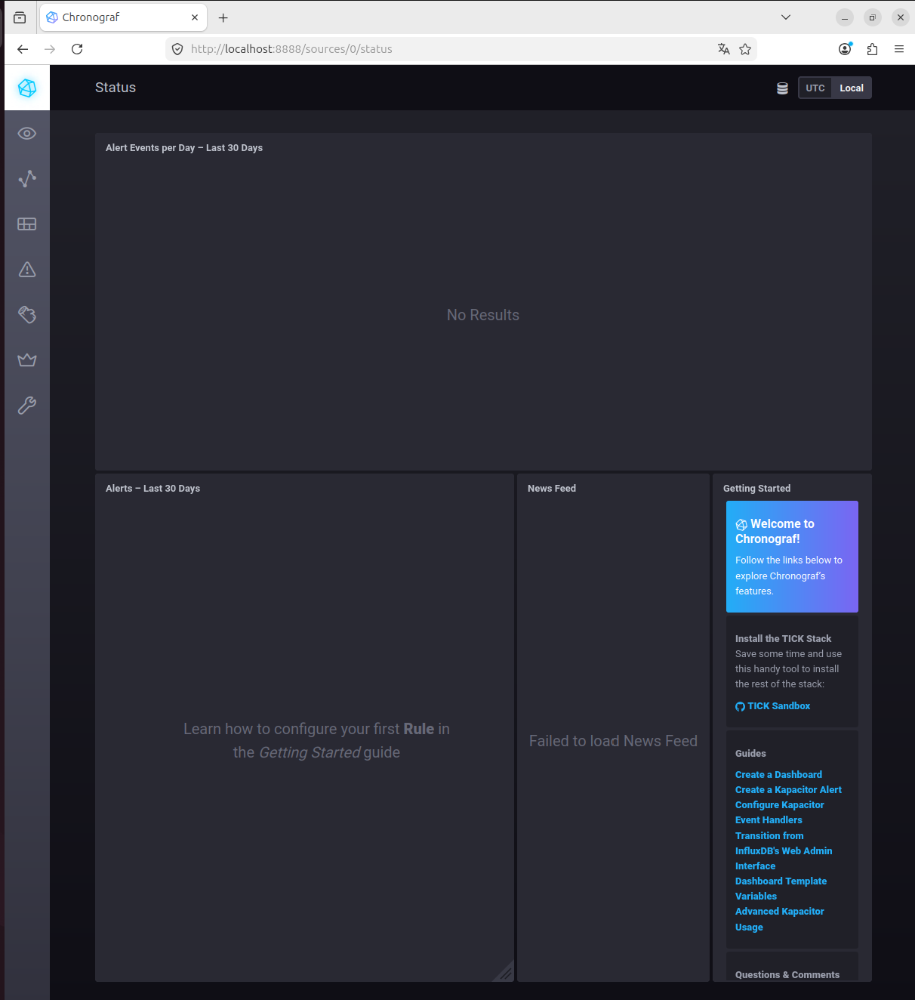
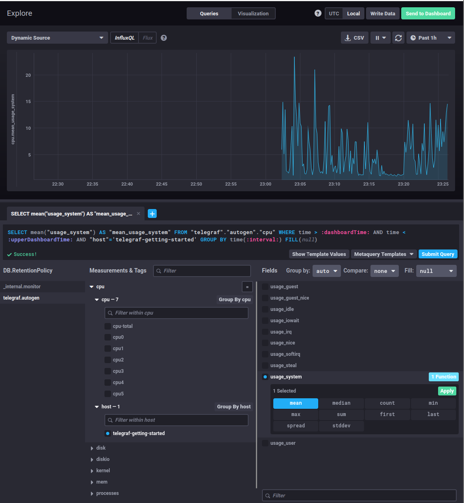
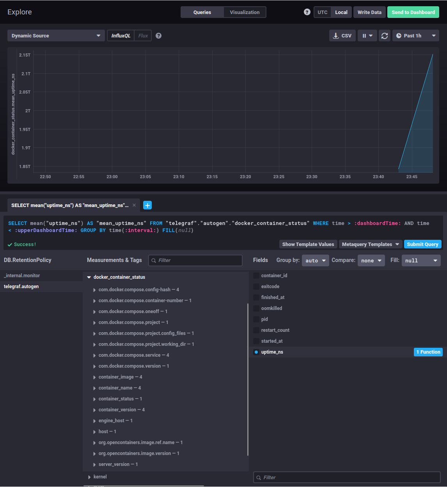
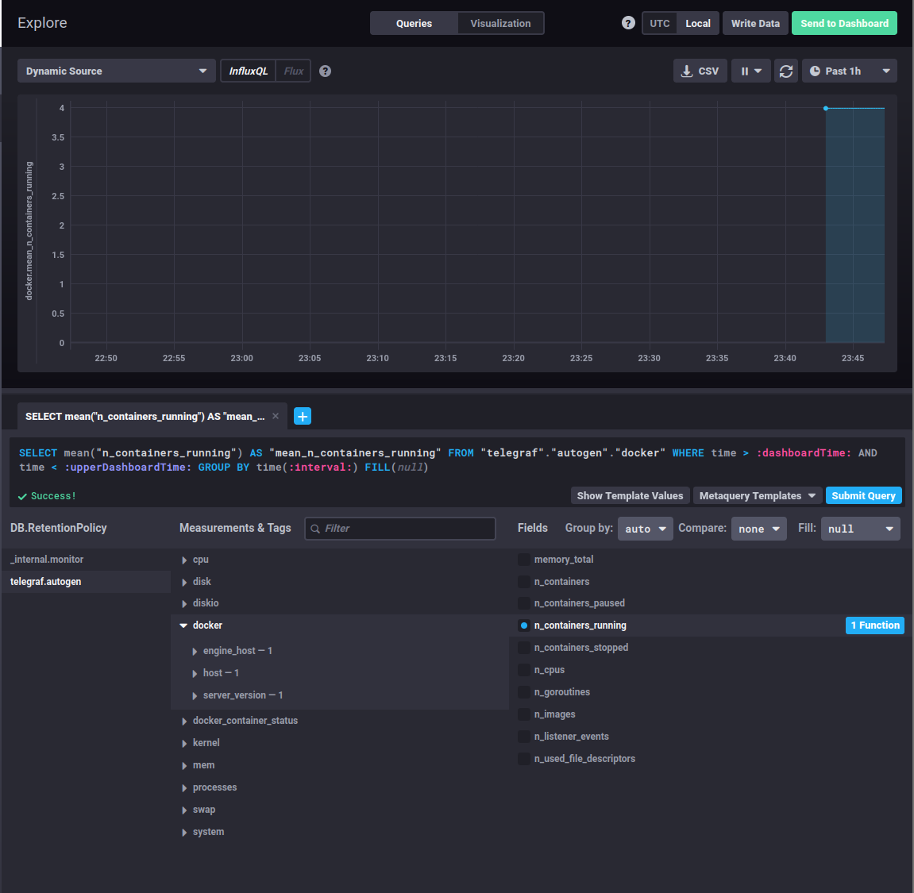

# Домашнее задание к занятию «Системы мониторинга»
Выполнил: Береснев Игорь Андреевич

---

1. Вас пригласили настроить мониторинг на проект. На онбординге вам рассказали, что проект представляет из себя платформу для вычислений с выдачей текстовых отчетов, которые сохраняются на диск. Взаимодействие с платформой осуществляется по протоколу http. Также вам отметили, что вычисления загружают ЦПУ. Какой минимальный набор метрик вы выведите в мониторинг и почему?

Проект - платформа для вычислений, выдает отчеты, сохраняет их на диск, общается по HTTP. Нагрузка идет на процессор.

- **CPU usage** - нагрузка на процессор, чтобы видеть, когда вычисления перегружают систему.
- **RAM usage** - чтобы контролировать утечки памяти и не допустить падения сервиса.
- **Disk usage и inodes** - отчеты пишутся на диск, важно знать, когда заканчивается место.
- **HTTP-коды ответов** - чтобы видеть доступность API и ошибки.
- **Ошибки в логах приложения** - для быстрой реакции на сбои.

---

2. Менеджер продукта посмотрев на ваши метрики сказал, что ему непонятно что такое RAM/inodes/CPUla. Также он сказал, что хочет понимать, насколько мы выполняем свои обязанности перед клиентами и какое качество обслуживания. Что вы можете ему предложить?

Менеджеру не нужны технические термины. Ему важно, довольны ли клиенты.

- Ввести SLA (Service Level Agreement) - то есть целевой уровень качества.
- Отслеживать **доступность** сервиса: процент успешных запросов.
- Сделать простой дашборд, где видно: сколько запросов обработано, с какой скоростью, сколько ошибок.
- Установить цель: доступность > 99.9%, время ответа < 2 секунд.

---

3. Вашей DevOps команде в этом году не выделили финансирование на построение системы сбора логов. Разработчики в свою очередь хотят видеть все ошибки, которые выдают их приложения. Какое решение вы можете предпринять в этой ситуации, чтобы разработчики получали ошибки приложения?

Денег на ELK нет, а разработчикам нужны ошибки.

- Настроить отправку критических ошибок в **Sentry** - там есть бесплатный тариф.
- Или написать простого бота, который отправляет ошибки в **Telegram или Slack**.
- Или поставить легкий и бесплатный **Grafana Loki** - он хорошо работает и хранит логи локально.

---

4. Вы, как опытный SRE, сделали мониторинг, куда вывели отображения выполнения SLA=99% по http кодам ответов. Вычисляете этот параметр по следующей формуле: summ_2xx_requests/summ_all_requests. Данный параметр не поднимается выше 70%, но при этом в вашей системе нет кодов ответа 5xx и 4xx. Где у вас ошибка?

`успешные запросы / все запросы`. Формула дает 70%, но при этом ошибок 4xx и 5xx нет.

Скорее всего, проблема в том, что мы не учитываем:

- **3xx-коды** (редиректы) - они считаются ошибкой, хотя это не так.
- **Обрывы соединений** - запрос вообще не дошел до сервера.

Нужно пересмотреть, что считать успехом. Возможно, стоит включить в успех и 3xx, или смотреть на количество оборванных соединений.

---

5. Опишите основные плюсы и минусы pull и push систем мониторинга.


**Pull-системы (сами собирают данные):**
- Плюсы: проще контролировать данные, легче найти упавшие сервисы.
- Минусы: нужен доступ ко всем серверам, сложнее масштабировать.

**Push-системы (агенты сами отправляют данные):**
- Плюсы: лучше для временных задач, проще обходить NAT и динамические IP.
- Минусы: сложнее гарантировать доставку, тяжело понять, упал сервис или просто перестал отправлять данные.

---

6. Какие из ниже перечисленных систем относятся к push модели, а какие к pull? А может есть гибридные?

    - Prometheus 
    - TICK
    - Zabbix
    - VictoriaMetrics
    - Nagios

- **Prometheus** - Pull (иногда используют Pushgateway).
- **TICK (Telegraf, InfluxDB, Chronograf, Kapacitor)** - Push.
- **Zabbix** - гибридный, но чаще Pull.
- **VictoriaMetrics** - Pull, но есть vmagent для Push.
- **Nagios** - Pull.

---

7. Склонируйте себе репозиторий и запустите TICK-стэк, используя технологии docker и docker-compose.

В виде решения на это упражнение приведите скриншот веб-интерфейса ПО chronograf (http://localhost:8888).

P.S.: если при запуске некоторые контейнеры будут падать с ошибкой - проставьте им режим Z, например ./data:/var/lib:Z

## Скриншот веб-интерфейса Chronograf:



---

8. Перейдите в веб-интерфейс Chronograf (http://localhost:8888) и откройте вкладку Data explorer.
        
 - Нажмите на кнопку Add a query
 - Изучите вывод интерфейса и выберите БД telegraf.autogen
 - В `measurments` выберите cpu->host->telegraf-getting-started, а в `fields` выберите usage_system. Внизу появится график утилизации cpu.
 - Вверху вы можете увидеть запрос, аналогичный SQL-синтаксису. Поэкспериментируйте с запросом, попробуйте изменить группировку и интервал наблюдений.

Для выполнения задания приведите скриншот с отображением метрик утилизации cpu из веб-интерфейса.

## Скриншот график утилизации CPU



---

9. Изучите список [telegraf inputs](https://github.com/influxdata/telegraf/tree/master/plugins/inputs). 
Добавьте в конфигурацию telegraf следующий плагин - [docker](https://github.com/influxdata/telegraf/tree/master/plugins/inputs/docker):
```
[[inputs.docker]]
  endpoint = "unix:///var/run/docker.sock"
```

Дополнительно вам может потребоваться донастройка контейнера telegraf в `docker-compose.yml` дополнительного volume и 
режима privileged:
```
  telegraf:
    image: telegraf:1.4.0
    privileged: true
    volumes:
      - ./etc/telegraf.conf:/etc/telegraf/telegraf.conf:Z
      - /var/run/docker.sock:/var/run/docker.sock:Z
    links:
      - influxdb
    ports:
      - "8092:8092/udp"
      - "8094:8094"
      - "8125:8125/udp"
```

После настройке перезапустите telegraf, обновите веб интерфейс и приведите скриншотом список `measurments` в 
веб-интерфейсе базы telegraf.autogen . Там должны появиться метрики, связанные с docker.

Факультативно можете изучить какие метрики собирает telegraf после выполнения данного задания.

## Скриншот метрик



## Скриншот контейнеров


